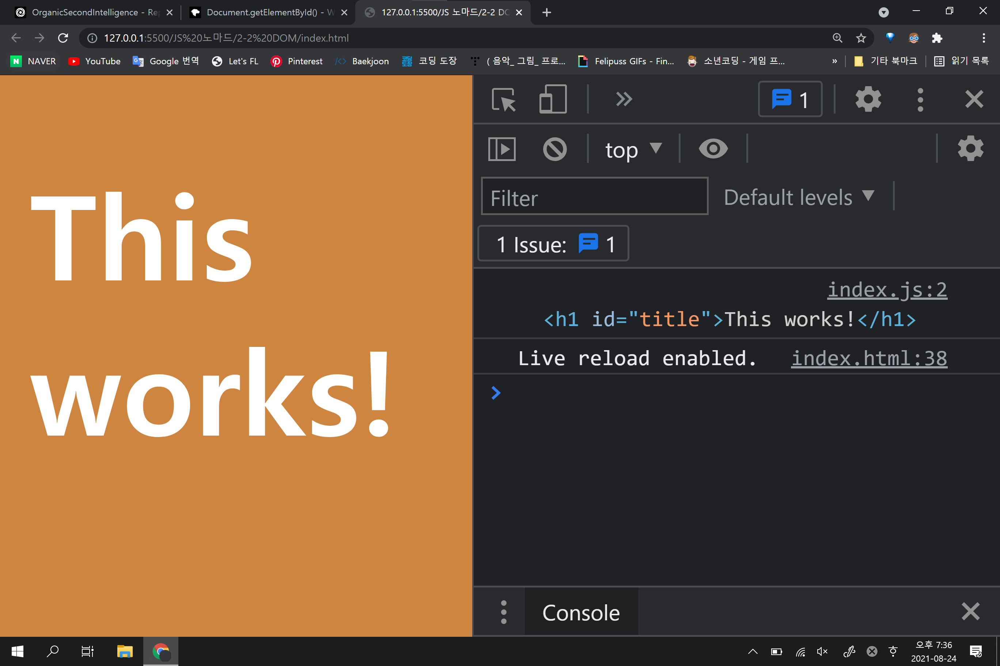
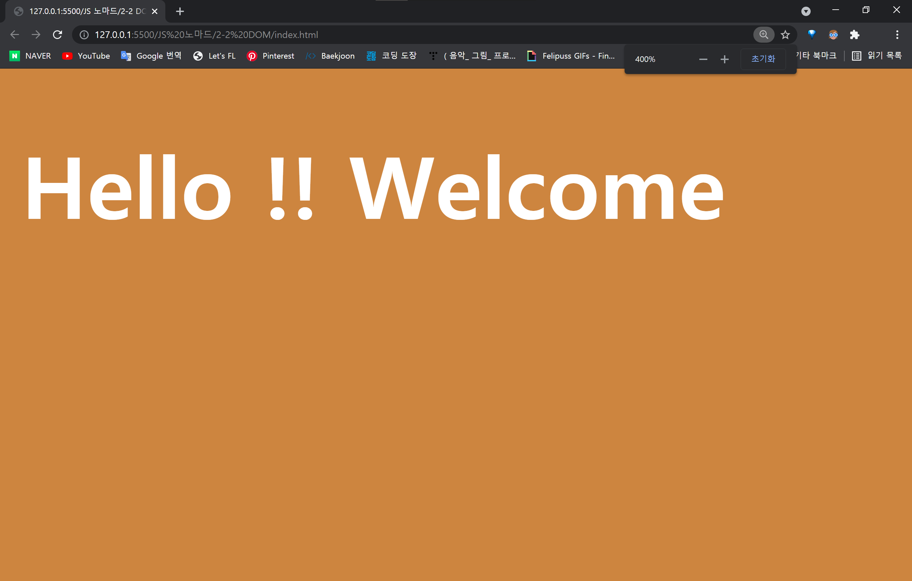

```js
const title = document.getElementById("title");
console.log(title);
```
### 결과물


```
html으로 자바스크립트 문법을 사용해보았다.

이것을 DOM이라고 부른다 
(Document Object Model)
    HTML의 모든 요소는
     일종의 객체로 바꿀 수 있다.

```

```js
title.innerHTML = "Hello !! Welcome";
```

