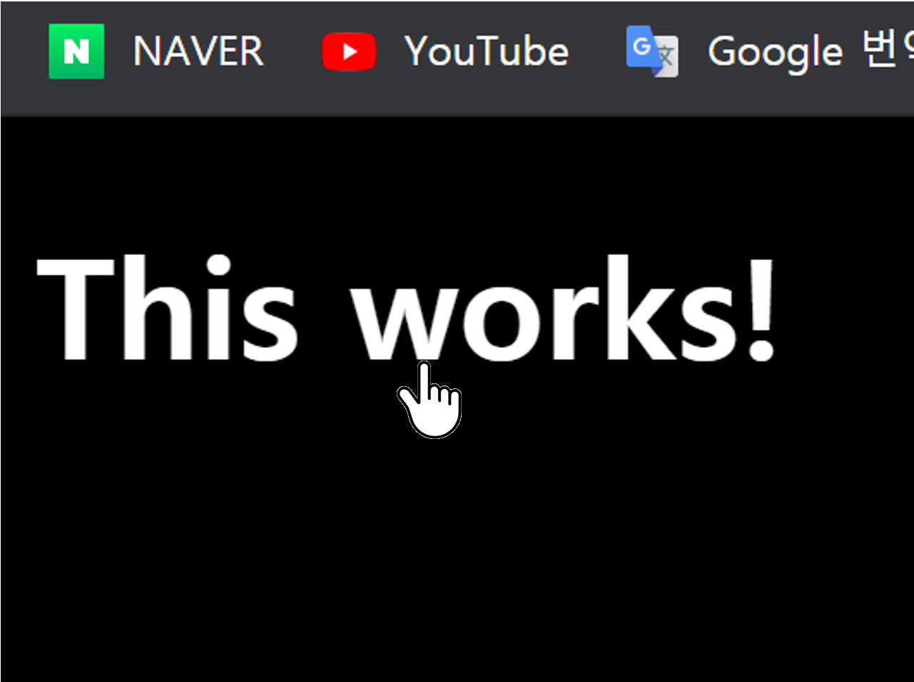
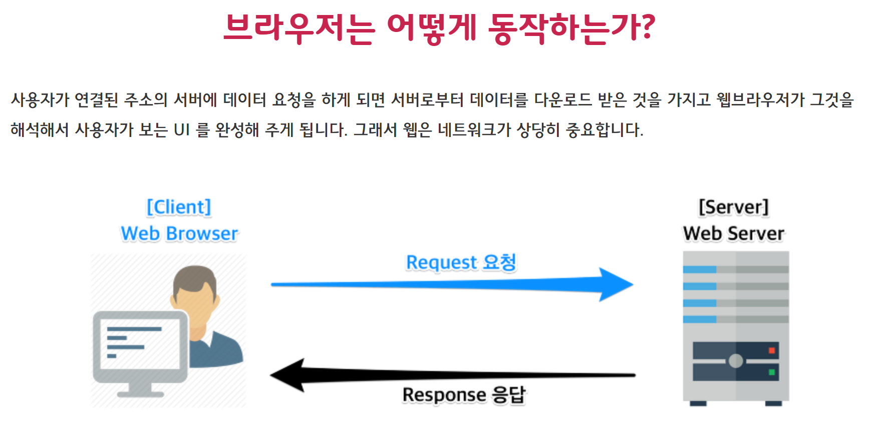

<style>
body {
    font-family : "Ariel Black";
}
</style>
JS로 html을 간섭할 수 있게된다.
이벤트에 대해 동적인 반응을 할 수 있도록
뭘 부르고, 뭘 바꾸고

--------------------------------------------------------------

### **1. 쿼리 선택자**
```js
document.querySelector("css 선택자와 비슷함")
    클래스나 태그, 아이디 모두 가져온다.
    선택자와 일치하는 첫번째 요소를 반환함
    
    getElement
        tag
        id
        name
```

--------------------------------------------------------------

### **2. 함수의 호출의 트리거에 따른 종류**
* function() vs function
    1. function() 은 바로 시작
    2. function은 동작이 들어올떄마다 실행 
* 화살표 함수
  * [화살표 함수]("arrowfunc.md")

--------------------------------------------------------------

### **3. === vs ==  차이는?**
1.  === : 엄격한 동등성 (타입과 값 둘다 같아야함)
2.  == : 강제 형변환을 통한 동등 비교 (값만 같아도 true 여지 있음)
  * Falsy 값
    * 0 과 false , "" ,NULL ,undefined, NaN 모두 동일한것  

--------------------------------------------------------------

### **4. prompt**
```js
const data = prompt("string");
// 경고창을 띄우고,
//input 값이 data로 들어감
```
--------------------------------------------------------------

### **5. click 이벤트**
```js
if(curColor !== "어떤색")
    ...
else
    className = "" //이런식으로 클래스를 비워둘 수 있다
```
```html
<h1 id="title" class="string">
            :
            V
<h1 id="title" class>
```

--------------------------------------------------------------

### **6. 버튼 과 같은 동작을 하게 해보자**
```html
<h1 id="title" class="btn"></h1>
```
```css
.btn {
    cursor: pointer;
}
```



--------------------------------------------------------------

### **7. class**
```js
요소.classList;
    add()
    remove()
    containes(""); // ture/false;
    toggle("str"); //str이 있으면 str 지우고 str 생기고..
```


--------------------------------------------------------------

### **8. 이벤트 리스너**

| 포커스 이벤트  | 폼 이벤트    | 뷰 이벤트     | 키보드 이벤트 | 마우스 이벤트                                    | 드래그앤 드롭                    |
| :------------- | :----------- | :------------ | :------------ | :----------------------------------------------- | :------------------------------- |
| focus<br> blur | reset submit | scroll resize | keydown keyup | mouseenter mouseover click<br>dbclick mouseleave | dragstart drag<br>dragleave drop |

* addEventListener(이벤트명, 실행할 함수명, 옵션);
* removeEventListener(이벤트명, 실행할 함수명, 옵션);


--------------------------------------------------------------

### **9. setInterval(func, ms)**


--------------------------------------------------------------

### **10. localStorage**
setItem(key, val);
getItem();


--------------------------------------------------------------

### **11. 자바스크립트의 실행 타이밍**
#### Js : 프로토타입 기반 객체지향 언어<br>

브라우저에서 <span style="color : red">html파일을 읽을 때 같이 해석되고 실행된다.</span>

스크립트 언어란?
- 어플리케이션이 실행되는 동안 라인 단위로 **해석(인터프리터)** 되어 실행되는 언어.
- 별도의 컴파일 과정이 없다.
- 스크립트 언어를 해석하고 **실행해 줄 프로그램이 별도로** 필요하다.
- HTML 문서 내에서 스크립트 언어는 <script>와 </script> 사이에 작성한다.



```
JS인 <script> 태그를 만나면 
스크립트가 해석 및 실행되는 동안 문서의 파싱은 
중단되게 됩니다.

스크립트가 문서를 파싱하는 동안 스타일 정보를 요청하는 경우라면 문제가 됩니다.

스크립트가 문서를 파싱하는 동안 브라우저는 다른 작업을 수행하지 않기 때문에 스타일이 파싱되지 않은 상태가 되고 이렇게 되었을 때 화면 레이아웃이 제대로 구성되지 않은 상태로 사용자에게 뷰를 제공하게 될 확률이 높기 때문에 사용자 경험(UX)을 떨어뜨리는 결과를 초래하게 될 것입니다.
```
#### ***스크립트 소스를 body 태그 끝에<br> 두는 것을 권장하고 있습니다.***

### **12. 스크립트의 로드 시점 - async, defer**

### **13. arr.filter arr.forEach**
```js
let arr = [5,10,15,20,25];
let result = [];

arr.forEach( (x) => {
    result.push(x-5);
})

```

### **14. CSS 문법 positon, 미디어쿼리, 애니메이션**

### **15. navigator **
geolocation

### **16. fetch, then**

### **10.**